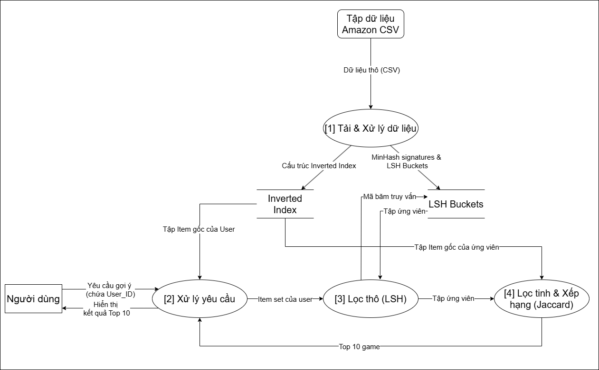
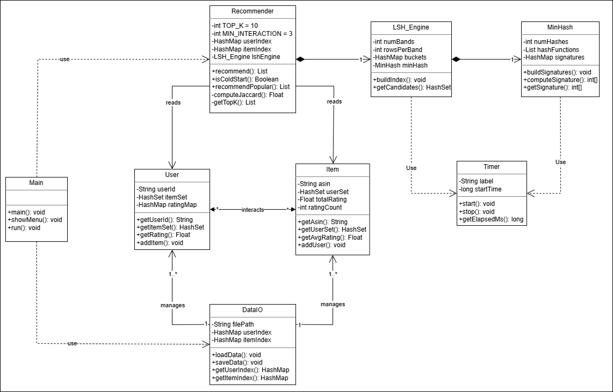
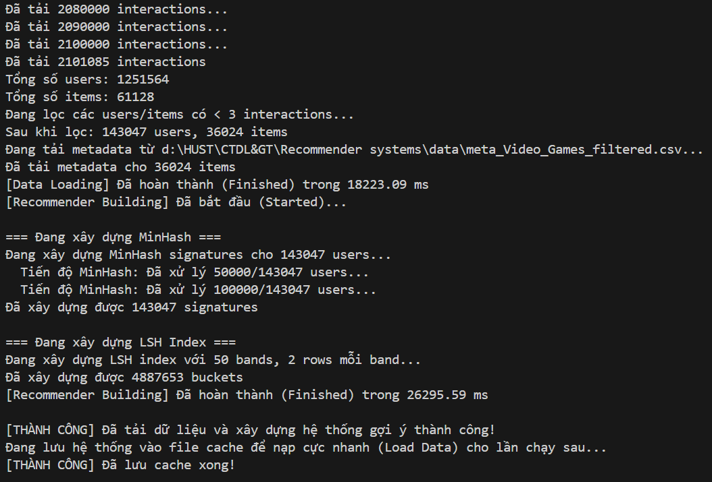
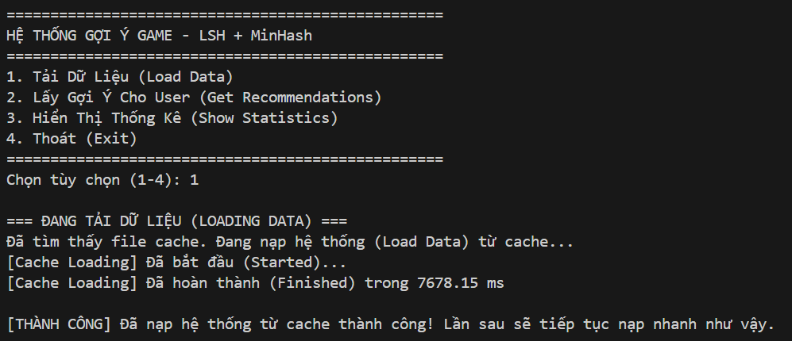
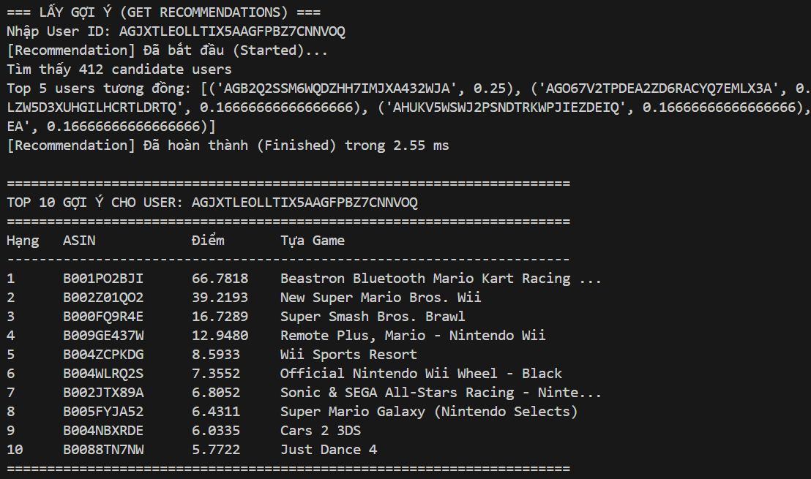
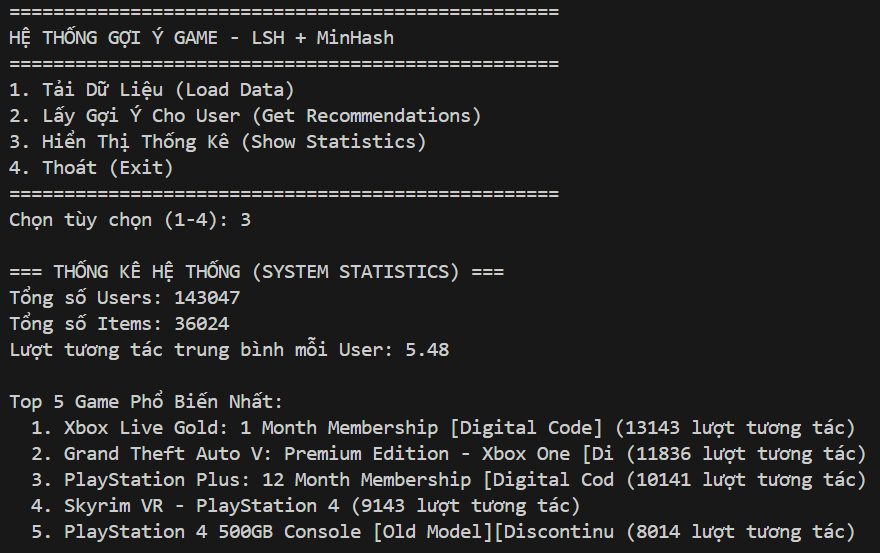

# Báo cáo Đồ án MI3060: Hệ Thống Gợi Ý Game (Game Recommender System)

##  Giới Thiệu
Dự án triển khai một hệ thống gợi ý tựa game quy mô lớn dựa trên phương pháp **Collaborative Filtering**. Để giải quyết bài toán hiệu năng khi mở rộng quy mô (Scale), hệ thống áp dụng thuật toán **MinHash** kết hợp **Locality-Sensitive Hashing (LSH)**, cho phép xử lý hàng triệu lượt tương tác với độ trễ truy vấn chỉ tính bằng mili-giây, khắc phục hoàn toàn nút thắt cổ chai của phương pháp vét cạn (Brute-force) truyền thống.

---

##  Giai Đoạn 1: Phân Tích

### 1. Luồng Dữ Liệu (Data Flow)

*   **Đầu vào:** Bộ dữ liệu Amazon Video Games Reviews (hàng triệu bản ghi, kích thước >2GB) được xử lý qua Data Pipeline để trích xuất và làm sạch.
*   **Đầu ra:** Top 10 tựa game phù hợp nhất cho người dùng mục tiêu, được xếp hạng dựa trên độ đo **Jaccard Similarity**.
*   **Xử lý ngoại lệ (Cold Start):** Hệ thống tích hợp cơ chế Fallback, tự động chuyển hướng sang gợi ý các tựa game phổ biến nhất (Popularity-based) cho những người dùng chưa có lịch sử tương tác.

### 2. Cấu Trúc Dữ Liệu Cốt Lõi
*   **Hash Map (Dictionary):** Đóng vai trò là cấu trúc lưu trữ trung tâm (`user_index`, `item_index`). Giúp tra cứu định danh người dùng và vật phẩm với độ phức tạp $O(1)$.
*   **LSH Buckets (Hash Map Đa Tầng):** Lưu trữ các nhóm người dùng có hành vi tương đồng. Khóa (Key) là tuple `(band_id, hash_value)` và Giá trị (Value) là cấu trúc `Set` chứa các User IDs.
*   **Set (Tập Hợp):** Lưu trữ danh sách các tựa game một user đã chơi. Cấu trúc này tối ưu hóa các phép toán đại số tập hợp (Giao/Hợp) khi tính toán Jaccard Similarity xuống mức $O(1)$, vượt trội so với việc duyệt mảng $O(N)$.

---

##  Giai Đoạn 2: Thiết Kế Hệ Thống (Sơ đồ Lớp)

Kiến trúc phần mềm được thiết kế theo mô hình Hướng đối tượng (OOP), đảm bảo tính đóng gói và dễ dàng mở rộng.

---

##  Giai Đoạn 3: Triển Khai Module
Hệ thống được module hóa thành các luồng xử lý độc lập:

1. **Module Data (`utils/DataIO.py`, `convert_data.py`)**: Đảm nhiệm luồng ETL (Extract, Transform, Load). Thực hiện Data Cleaning để loại bỏ nhiễu (phụ kiện rác, dữ liệu khuyết thiếu) và xây dựng Index Map.
2. **Module Models (`models/User.py`, `models/Item.py`)**: Định nghĩa Data Models và các phương thức thực thể.
3. **Module Core (`core/MinHash.py`, `core/LSH_Engine.py`, `core/Recommender.py`)**: Triển khai Logic lõi. Hệ thống ứng dụng hàm băm MD5 để tạo chữ ký (Signatures) và tích hợp kỹ thuật Caching (thư viện `pickle`) để luân chuyển trạng thái hệ thống lên bộ nhớ, giảm tối đa thời gian khởi động.

---

##  Giai Đoạn 4: Đánh Giá Hiệu Năng & Độ Phức Tạp

### 1. Phân Tích Big-O
*(Quy ước: $N$ là số lượng Users, $M$ là số lượng Items, $K$ là số lượng hàm Hash, và $L$ là số items trung bình của một user).*

- **Xây dựng Chữ ký MinHash (`build_signatures`)**: Tính signature cho toàn bộ hệ thống mất $O(N \times K \times L)$. Việc băm item được tối ưu $O(M)$ nhờ cache lại mã MD5.
- **Phân bổ LSH Index (`build_index`)**: Đưa user vào buckets mất $O(N \times \text{Bands})$.
- **Truy vấn Gợi ý (`recommend`)**:
  - Lấy tập ứng viên $C$ từ LSH: $O(\text{Bands})$.
  - Tính toán Jaccard và xếp hạng top $K$: $O(C \times L + C \log C)$.
- **Kết luận**: Phương pháp này giảm thiểu không gian tìm kiếm từ quy mô toàn cục $O(N \times L)$ xuống quy mô cục bộ $C \ll N$.

### 2. Kết Quả Thực Nghiệm (Performance Testing)
Thử nghiệm trên tập dữ liệu đã qua tiền xử lý:
- **Khối lượng**: ~143,000 Users và ~36,000 Items (Tương đương hơn 2.1 triệu tương tác hợp lệ).
- **Tốc độ Khởi động**: Nạp dữ liệu từ Cache chỉ tốn ~7 giây (Giảm 85% thời gian so với Cold Boot đọc từ file CSV).
- **Độ trễ Truy vấn (Latency)**: Tìm kiếm và tính toán Top 10 Game diễn ra với tốc độ **~2.55 ms** (Với ngưỡng LSH threshold được tinh chỉnh ở mức 14%).
- **Độ phức tạp Không gian (Space Complexity)**: Tối ưu hóa dung lượng RAM thông qua Hash Map, cho phép chạy cục bộ một cách mượt mà trên các máy trạm cá nhân.

### 3. Đánh Giá Chất Lượng Phân Tích
Pipeline `clean_and_convert` đã xử lý triệt để hiện tượng Data Leakage. Các yếu tố nhiễu loạn (Noise) như "Cáp sạc", "Kính cường lực" đã bị loại bỏ. Top 5 sản phẩm hiện hành phản ánh chính xác phân phối của một tập dữ liệu Game tiêu chuẩn:
1. Xbox Live Gold: 1 Month Membership
2. Grand Theft Auto V: Premium Edition
3. PlayStation Plus: 12 Month Membership
4. Skyrim VR - PlayStation 4
5. PlayStation 4 500GB Console

---

##  Ảnh Demo Hệ Thống (Screenshots)

**1. Tải và Xây dựng Hệ thống lần đầu:**

**2. Tải và Xây dựng Hệ thống lần 2 (từ cache):**

**3. Tốc độ Gợi ý Tức thời:**

**4. Thống kê Hệ thống không còn Data Leakage:**

---

